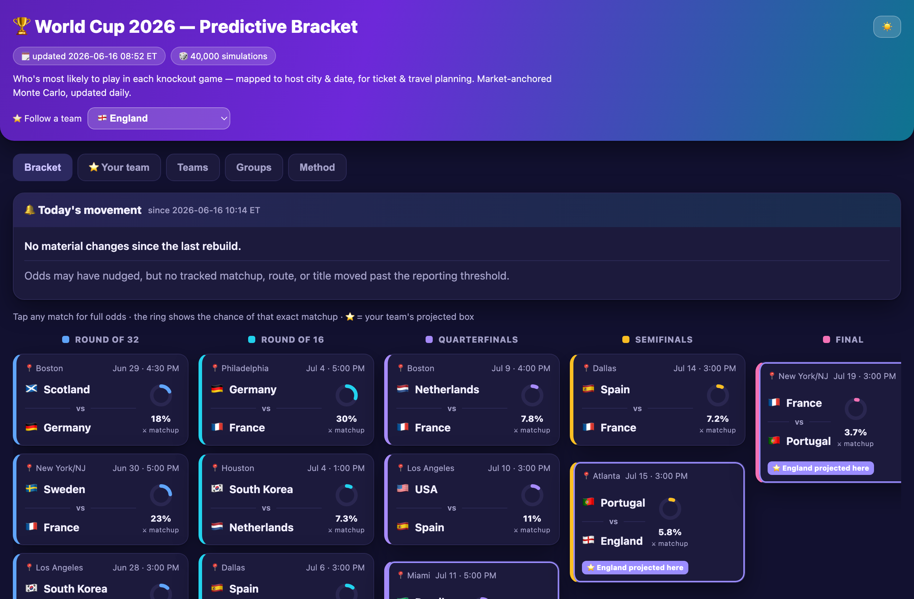

# 🏆 World Cup 2026 — Predictive Bracket

**Who's most likely to play in each knockout game — mapped to the host city & date, so you can plan tickets and travel.** A market-anchored Monte Carlo model that auto-updates through the tournament, flags which bracket matchups shifted since the last build, and **explains why each one moved** — which result or odds swing drove it — so you can time ticket purchases. Pick any of the 48 teams to see its projected route and where to be.

Most World Cup tools tell you *who will win*. This one tells you *who is likely to be playing in **this city on this date*** — the gap between the prediction sites and the travel guides.

**▶ Live site: https://milanpcooper-ui.github.io/world-cup-2026-bracket-model/**



> ⚠️ A forecast, not a guarantee — and **not betting advice**. Not affiliated with FIFA. Probabilities shift with every result; the bracket auto-rebuilds every 3 hours during the tournament. Verify anything before spending money on it.

## Open this
`World_Cup_2026_Predictor.html` — double-click to open in any browser. No internet
needed; everything (including flag emoji) is embedded. Light/dark toggle sits top-right.
Tabs: Bracket (tap any box for full odds), ⭐ Your team (pick any of the 48 sides to see
its projected route and where-to-be cities), Teams, Groups, Method. Mobile-first — on a
phone the bracket switches to a round-by-round view.

## Publishing to the web
The HTML is fully standalone — drop `World_Cup_2026_Predictor.html` and `og-preview.png`
onto any static host (GitHub Pages, Netlify, Vercel). For link previews to show the share
card in iMessage/Slack/X, rebuild with your final URL so the Open Graph tags are absolute:
`WC_SITE_URL=https://your-domain python3 gen_dashboard.py`.

## How it works
- **Engine:** each match = independent Poisson goals, with expected goals set by the
  Elo-rating gap (host nations +50). Group tables ranked by points → GD → GF. Knockout
  ties resolved by an Elo-logistic extra-time/penalty model.
- **Market anchor:** the top teams' strengths are fitted to the betting market's title
  odds (Kalshi via Covers, 13 Jun 2026) so the model reproduces the market at the top;
  the rest of the 48-team field is set by world-football Elo (15 Jun 2026).
- **Bracket:** group winners/runners-up and the best-8 third-placed teams are routed
  using FIFA's exact Annex C allocation table (all 495 combinations).
- **Output:** 40,000 simulated tournaments → per-match team probabilities, per-team
  round-reach odds, and any team's most-likely route (the dashboard's "⭐ Your team" view).

## Files
- `data.py` — groups, Elo, market odds, completed results, fixtures, venues, knockout bracket.
- `annexC.txt` — FIFA Annex C third-place allocation (495 rows).
- `model.py` — simulation + market calibration engine.
- `build.py` — runs the model → `results.json` (includes the day-over-day `changes` diff, with a per-flip `why` and a build-level `summary` attributing each bracket move to the results/odds that caused it).
- `gen_dashboard.py` — `results.json` → the dashboard HTML, `index.html`, and a tiny `version.json`. One template with a light/dark toggle, team flags, follow-any-team view, mobile-first bracket, and a "Today's movement" card that explains why each matchup shifted. Honours `WC_SITE_URL` for absolute Open Graph tags.
- `publish.sh` — rebuild and push to GitHub Pages, but only when a live input actually changed.
- `results_log.json` · `odds.json` · `match_odds.json` — the three live inputs you edit to update the model (new scores, title odds, per-game 1X2 lines). See [CONTRIBUTING.md](CONTRIBUTING.md).
- `og-preview.png` · `screenshot.png` — the link-preview share card and the README hero image.

## Updating & auto-publish
During the tournament the live site keeps itself current via a scheduled rebuild that
runs every 3 hours: it pulls the day's finished results and refreshed odds into the
three input files, then runs `publish.sh`, which rebuilds and pushes to `main` **only
when an input actually changed** (fixed RNG seeds mean a no-data rebuild is a no-op, so
it never spams commits). GitHub Pages redeploys within ~1 minute.

To update manually at any time:

```sh
git pull --rebase
# edit results_log.json / odds.json / match_odds.json  (see CONTRIBUTING.md)
bash publish.sh "what changed"
```

`EXECUTE.md` documents the full results-and-odds workflow.

## Contributing
This is an open project and improvements are very welcome — especially keeping the
inputs fresh (Elo ratings, title odds, per-game betting lines) and sharpening
calibration. Most useful contributions need **no code** — just edit a JSON input and
rebuild. See [CONTRIBUTING.md](CONTRIBUTING.md).

## License
[MIT](LICENSE) © 2026 Milan Cooper. The data inputs (schedule, venues, Elo ratings,
market odds) are publicly reported facts used here for a non-commercial forecast.

## Caveat
This is a forecast, not a guarantee. Early in the group stage the bracket is highly
uncertain and swings with every result. The model won't beat the betting market on raw
accuracy — its value is the bracket-to-venue mapping for planning.
